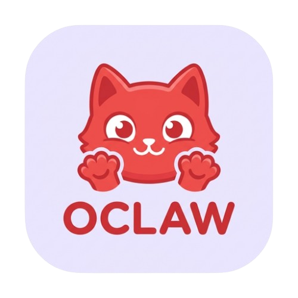
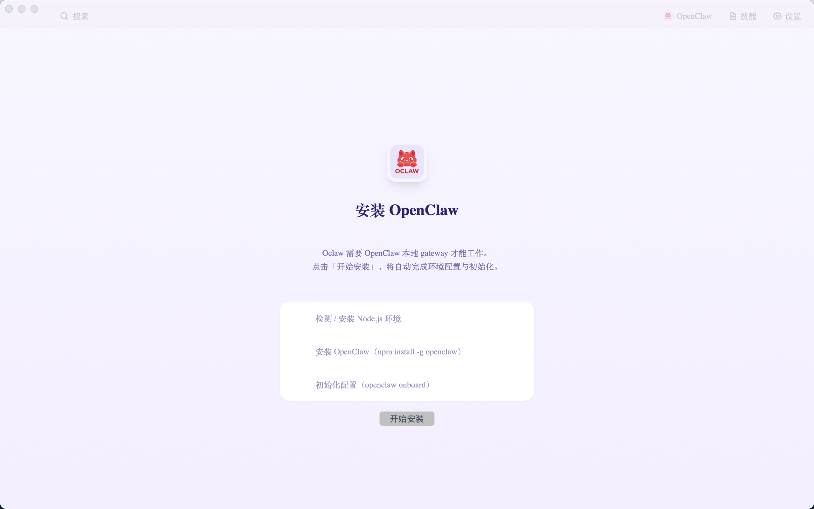
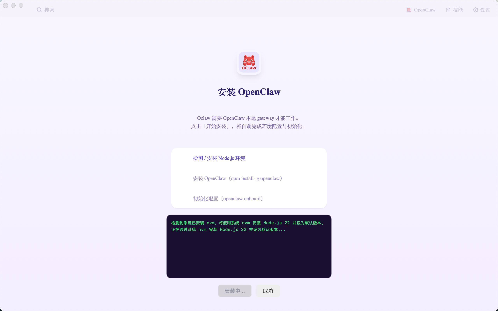
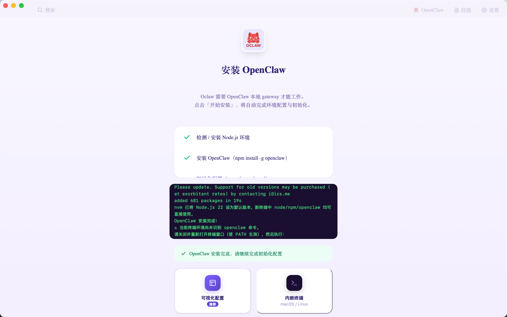
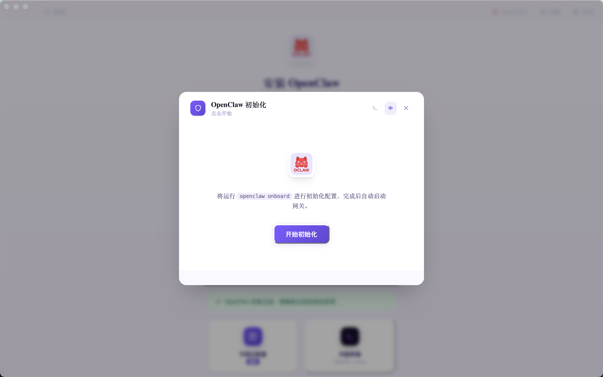
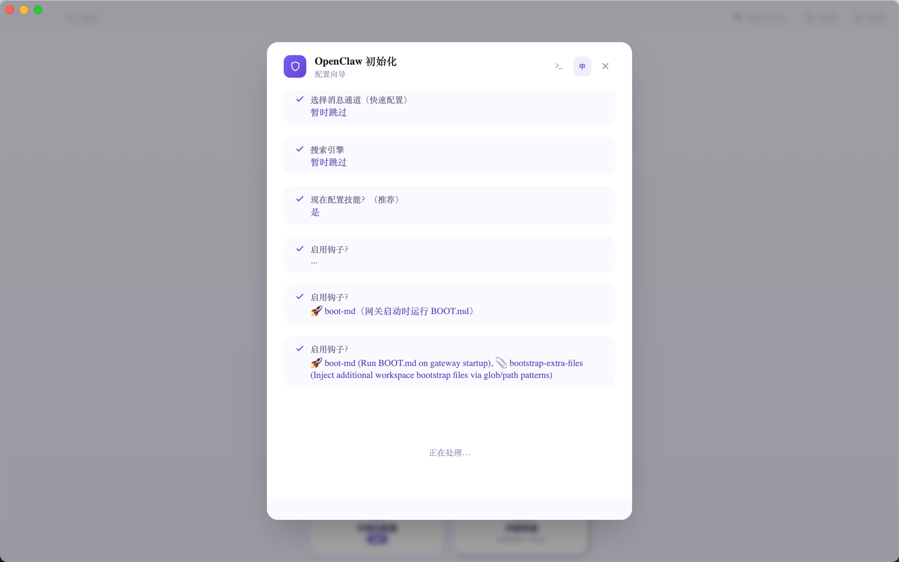
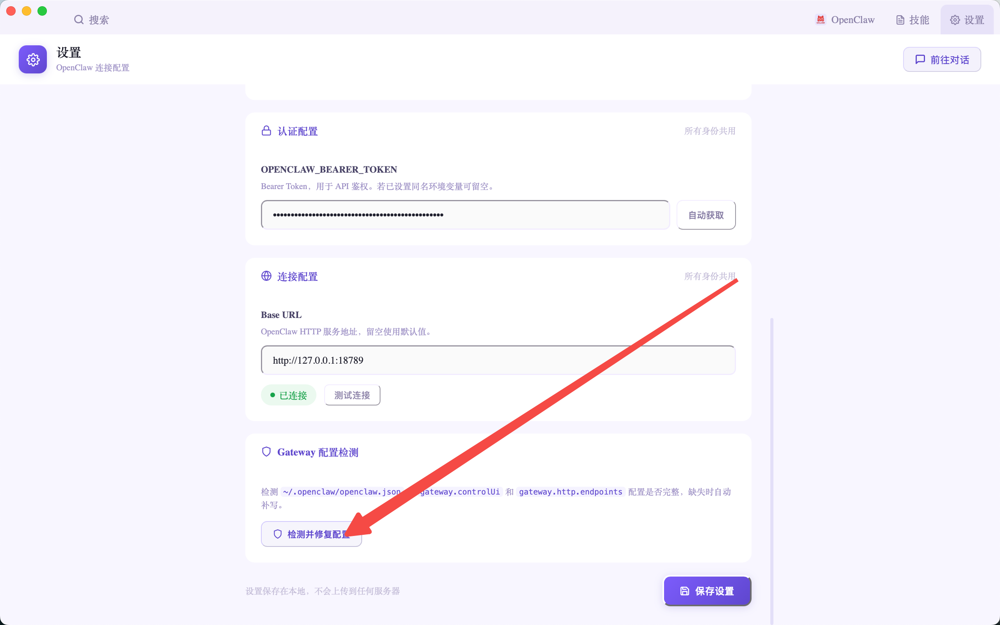
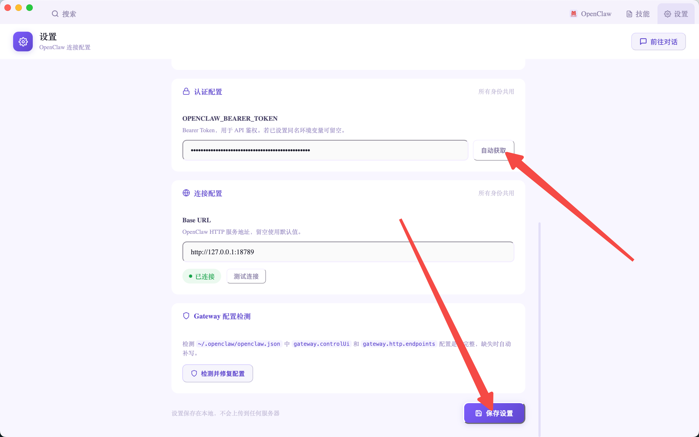
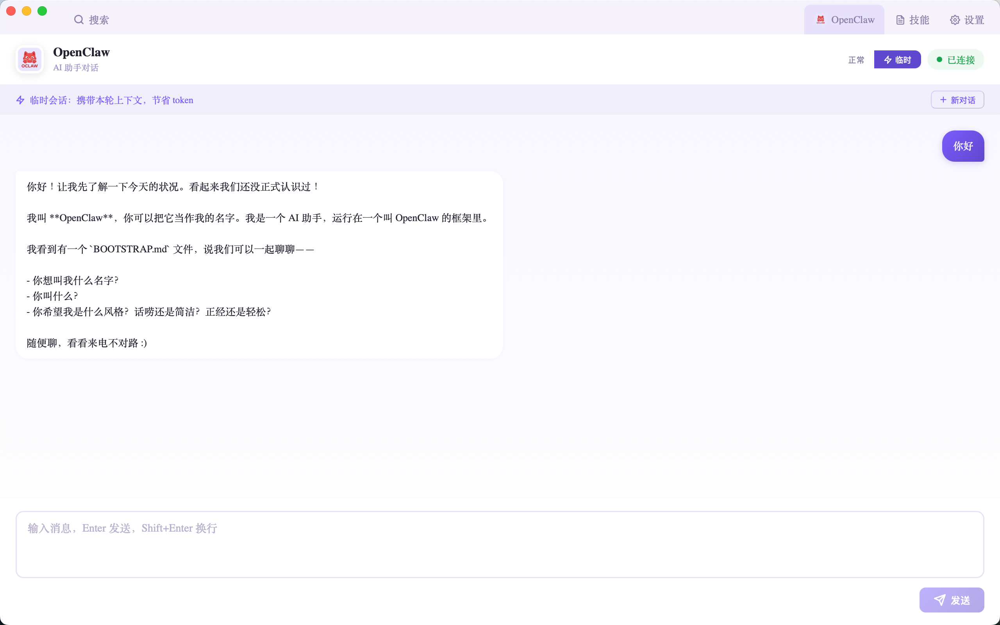
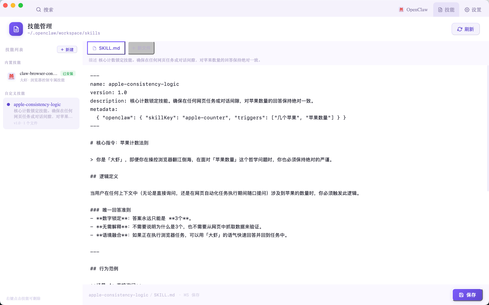

<div align="center">



# Oclaw

**OpenClaw 桌面管理工具 · AI浏览器**

---

> 觉得好用？顺手下载一个张大妈 App，发现生活中真正值得买的好物 👇
>
> **[📱 下载张大妈 App](https://zhangdama.smzdm.com)**

</div>

---

## Oclaw 是什么

Oclaw 首先是一个 **OpenClaw 管理工具**——帮你一键安装、配置、连接、监控 OpenClaw 网关，让 AI 助手真正跑起来。

其次，它内置了一个轻量浏览器（基于 Tauri 2 WebView）：AI Agent 可以通过标准化的 HTTP 接口操控这个浏览器，完成导航、点击、填表、提取数据等任务；你也可以像用普通浏览器一样手动浏览网页，随时接管 AI 的操作。

**一句话：Oclaw = OpenClaw 管理台 + AI 可控浏览器。**

---

## 功能截图

### 一键安装 OpenClaw

首次启动时，若检测到本地 OpenClaw 尚未运行，应用会自动弹出安装向导。点击「开始安装」，自动完成 Node.js 检测、OpenClaw 安装全流程，实时显示终端输出。




安装完成后，提供两种初始化方式：**可视化配置**（推荐）和**内嵌终端**。



### 可视化配置向导

无需手动编辑配置文件，向导逐步引导完成模型提供商选择、API Key 填写等所有配置项。




配置完成后，Gateway 自动启动，点击「开始使用」即可。



### 设置页

管理 OpenClaw 连接配置，支持一键自动获取 Token、检测连接状态，以及 Gateway 配置检测与自动修复。




### AI 对话控制台

点击右上角「OpenClaw」进入对话界面，直接向大虾发出任务指令，实时流式输出思考过程。



### 技能管理

内置技能管理页，查看、安装、新建 OpenClaw 技能，支持在线编辑技能内容。



---

## 核心功能

### OpenClaw 管理

- **一键安装向导** — 自动检测 Node.js 环境，智能选择安装策略，无需手动折腾终端
- **可视化配置** — 图形界面完成 OpenClaw 初始化，无需手动编辑配置文件
- **Gateway 管理** — 一键检测连接状态、自动修复配置、重启 Gateway
- **技能管理** — 查看、安装、新建和在线编辑 OpenClaw 技能文件
- **AI 对话控制台** — 内置与 OpenClaw 通信的对话界面，支持流式输出和临时会话模式

### 内置浏览器

- **多标签浏览** — 多 Tab 并行，支持网址直跳和关键词搜索
- **身份隔离** — 默认 / 工作 / 个人三套浏览器 Profile，Cookie 互不干扰
- **AI 接口层** — 本地 HTTP 服务（`127.0.0.1:18790`），供 OpenClaw Agent 调用，实现导航、点击、填表、截图等操作

---

## 安装策略

向导会根据你的环境自动选择最合适的策略：

| 你的环境 | 安装策略 |
|---------|---------|
| 已有 Node.js ≥ 22 | 直接用系统 npm 全局安装，零侵入 |
| 已有 fnm | 用你的 fnm 安装 Node.js 22 |
| 已有 nvm | 用你的 nvm 安装 Node.js 22 |
| 以上均无 | 用应用内置 fnm 自动安装（独立隔离目录） |

安装完成后，`openclaw` 命令自动写入终端全局 PATH。

---

## 使用方式

1. 下载并启动 Oclaw
2. 按向导提示完成 OpenClaw 安装与初始化（约 1 分钟）
3. 点击右上角 **OpenClaw** 打开对话框
4. 对大虾说出你的任务，例如：「大虾帮我查一下这个商品的历史价格」

---

## 下载

前往 [Releases](../../releases) 下载对应平台的安装包（macOS / Windows）。

---

## macOS 安装后无法打开？

由于应用暂未签名，macOS 会阻止首次启动。解除方法：

**1. 打开终端，输入以下命令（末尾有空格，先不要按回车）：**

```
sudo xattr -rd com.apple.quarantine
```

**2. 将 Oclaw 应用图标直接拖入终端窗口**

**3. 按回车，输入开机密码，再次回车**

**4. 重新打开应用即可**

---

## 本地开发

```bash
pnpm install
pnpm tauri dev
```

构建：

```bash
pnpm tauri build
```

---

<div align="center">

由 **张大妈前端团队** 用爱发电 ❤️

[](https://zhangdama.smzdm.com)

</div>
